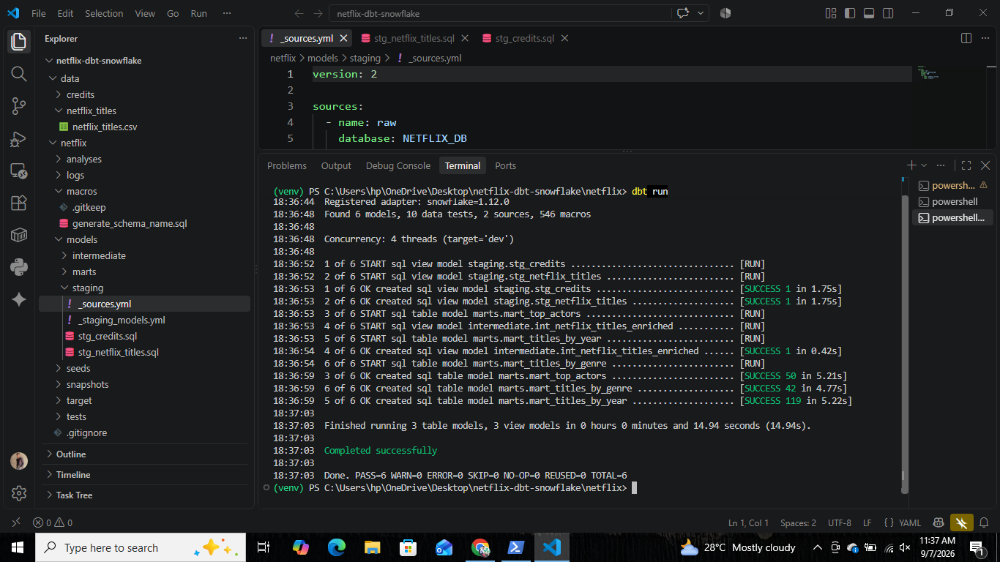
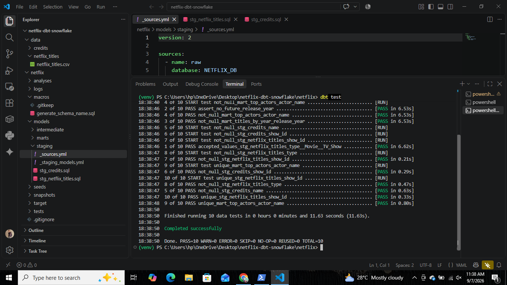
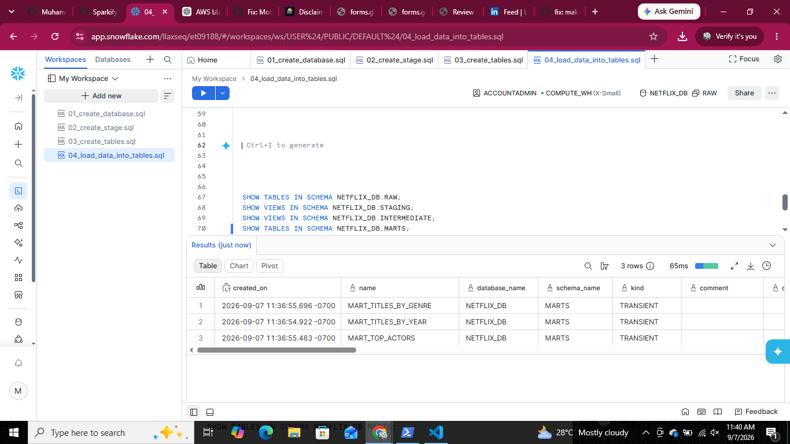

# Netflix dbt + Snowflake ELT Pipeline

End-to-end ELT project: the Netflix titles + credits dataset is loaded directly into
**Snowflake** (no S3/Terraform) via **Snowsight UI**, and transformed with **dbt**
following a medallion (Bronze/Silver/Gold) architecture.

```
local CSV ──▶ Snowflake internal stage ──▶ COPY INTO RAW tables ──▶ dbt staging ──▶ dbt intermediate ──▶ dbt marts
```


## Repository structure

```
netflix-dbt-snowflake/
├── data/
│   ├── credits/
│   │   └── credits.csv
│   └── netflix_titles/
│       └── netflix_titles.csv
├── snowflake/
│   └── ddl/
│       ├── 01_create_database.sql       DB, schemas, warehouse, role, grants
│       ├── 02_create_stage.sql          internal stage + CSV file format
│       ├── 03_create_tables.sql         RAW.NETFLIX_TITLES, RAW.CREDITS
│       └── 04_load_data_into_tables.sql COPY INTO from internal stage
├── screenshots/                          project execution screenshots
└── netflix/                             dbt project (profile: netflix)
    ├── models/
    │   ├── staging/          stg_netflix_titles, stg_credits (+ sources, tests)
    │   ├── intermediate/     int_netflix_titles_enriched
    │   └── marts/            mart_titles_by_year, mart_titles_by_genre, mart_top_actors
    ├── macros/                generate_schema_name (lands models in real schemas per layer)
    ├── tests/                 singular test: assert_no_future_release_year
    └── dbt_project.yml
```

## Setup

### 1. Create Python environment & install dbt

```bash
python -m venv venv
.\venv\Scripts\Activate.ps1
pip install dbt-snowflake
```

### 2. Set up Snowflake objects

Run the scripts in `snowflake/ddl/` in order (`01` → `03`) in a Snowsight worksheet:
1. `01_create_database.sql` — creates `NETFLIX_DB`, schemas (`RAW`, `STAGING`, `INTERMEDIATE`, `MARTS`), warehouse, role, grants
2. `02_create_stage.sql` — creates the CSV file format and the internal stage `NETFLIX_STAGE`
3. `03_create_tables.sql` — creates `RAW.NETFLIX_TITLES` and `RAW.CREDITS`

### 3. Load the data (no S3 — direct upload)

In Snowsight: **Data → Add Data → Load Files into a Stage**
- Schema: `NETFLIX_DB.RAW`, Stage: `NETFLIX_STAGE`
- Upload `netflix_titles.csv` and `credits.csv`

Then run `04_load_data_into_tables.sql` to `COPY INTO` the RAW tables.

### 4. Configure & run dbt

```bash
cd netflix
dbt init          # profile: netflix, connect to Snowflake account
dbt debug          # verify the connection
dbt run            # build all models
dbt test           # run data quality tests
```

## Data model

| Layer | Model | Materialization | Schema |
|-------|-------|----------------|--------|
| staging | `stg_netflix_titles`, `stg_credits` | view | `STAGING` |
| intermediate | `int_netflix_titles_enriched` | view | `INTERMEDIATE` |
| marts | `mart_titles_by_year`, `mart_titles_by_genre`, `mart_top_actors` | table | `MARTS` |

> **Note:** the two datasets use different ID schemes (`netflix_titles.show_id` = `s1…`
> vs `credits.id` = `tm84618`) and are modeled independently — they are not joined.

## Data quality tests

10 dbt tests covering:
- `unique` / `not_null` checks on primary identifiers (`show_id`, `actor_name`)
- `accepted_values` check on `type` (`Movie` / `TV Show`)
- Custom singular test `assert_no_future_release_year` — fails if any title has a
  release year later than the current year

Run with `dbt test` — all 10 currently pass.

## Key implementation notes

- Data is loaded **directly into Snowflake** via the Snowsight UI (drag & drop into
  an internal stage), removing the need for AWS S3 or Terraform entirely.
- The `NETFLIX_TITLES.CAST` column is stored unquoted (uppercase `CAST`) in Snowflake,
  so downstream staging SQL references it as `"CAST"`.
- A custom `generate_schema_name` macro ensures each dbt layer lands in its own
  schema (`STAGING` / `INTERMEDIATE` / `MARTS`) instead of all stacking into one
  default schema.

## Screenshots

### dbt run — full pipeline (6/6 models)


### dbt test — data quality checks (10/10 passing)


### Schema verification — RAW / STAGING / INTERMEDIATE / MARTS

